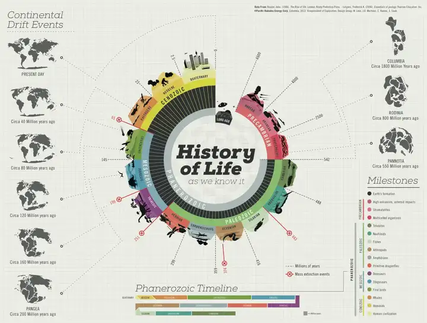
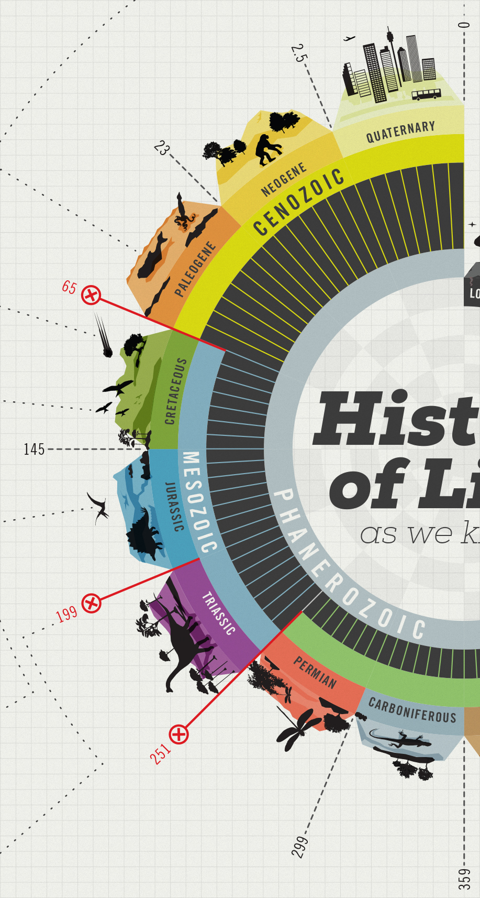
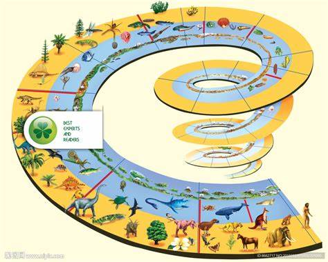

选取了一个时间可视化的案例，对生命的发展进行了可视化。

https://www.behance.net/gallery/10901127/History-of-Life

### **优点：**
1. **时空结构清晰**
   采用环形时间轴划分地质年代（如寒武纪、侏罗纪等），配合彩色区块与标志性生物图标（三叶虫、恐龙、人类），直观展现亿万年来生命演化的脉络。左侧大陆漂移图与时间轴联动，是一个具有时间属性的地图，直观地揭示了地理变迁与生物演化的关联。
   
   环形时间轴上还标注了每个时期的具体起讫时间，同时还有一个环形柱状图，应该表示的是生物量，有些时期结束后用一个红色叉号插入，随着柱状图骤降，是一些灾难性、灭绝性事件的发生（参看图例mass extinction evevts），比如恐龙灭绝，极端气候等。

2. **信息层级合理**
   - **核心重点突出**：中央环形图聚焦主要地质时期与代表性物种；
   - **扩展说明恰当**：右侧“Milestones”列出关键事件（如地球形成、大灭绝，first birds）；
   - **细节丰富**：底部Phanerozoic时间线提供更精细的年代划分与事件标注。这种分层设计兼顾整体认知与局部探究。

3. **视觉隐喻生动**
   用冰川轮廓象征寒冷期（如石炭纪-二叠纪）、火焰图案暗示火山活动，以及红色箭头标记大灭绝事件，强化了抽象数据的可感知性。

4. **学术严谨性**
   数据来源明确（右上角，Reader, 1986；Lutgens, 2006），确保内容可信度。

### **可优化方向：**
1. **交互性缺失**
   作为静态图表，难以动态展示生命演化的连续过程。若转化为数字可视化（如主体相近的可视化人类生命史的项目[GGP](https://www.ggp-i.org/community/impact/visualisation/)的动态生命史动画），可增强沉浸感。

2. **复杂性平衡**
   部分时期（如古生代）的生物图标略显拥挤，可能干扰快速阅读。可考虑通过缩放或分类筛选优化信息密度。生物都采用剪影，对于一些不熟悉的生物我们可能难以辨认。事实上完全可以彩印啊，已经有许多类似的版本，我在一些生物和地理的百科全书上见过一些螺旋式的可视化，它们采用的就是全彩的方式，十分详细清楚。比如下图。

   

### **适用场景**
适合作为科普教育素材，如博物馆科技馆展板、教材插图，其强视觉叙事能力能有效激发公众对生命史的兴趣。若结合活中自的自然实践知识，可形成互补的多媒介学习资源。

总体而言，该案例堪称科学传播与数据可视化的优秀实践，展现了如何通过设计思维将庞杂的地质-生物数据转化为大众可理解的视觉语言，是很好的一个面向大众的案例，偏向可视化轮盘的下半部分，艺术性非常强。。